# Slack Icons

Mostly logos, but all images scaled to 128x128 or smaller for use as Slack emojis (icons).

## The images

  
  
  
  
  
  
  
  
  
  
  
  
  
  
  
  
  
 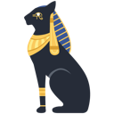 
 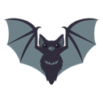 
  
  
  
  
  
  
  
  
  
  
  
  
  
  
  
  
  
  
  
  
  
  
  
  
  
  
  
  
  
  
  
  
  
  
  
  
  
  
  
  
  
  
 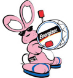 
  
  
  
  
  
  
  
  
  
  
  
  
  
  
  
 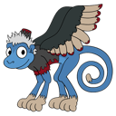 
  
  
  
  
  
  
 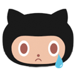 
 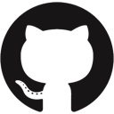 
  
  
  
 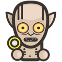 
  
  
  
  
  
  
 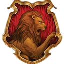 
  
  
  
  
  
  
  
  
  
  
  
  
  
  
  
  
  
  
  
  
  
  
  
  
  
  
  
  
  
 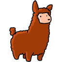 
  
  
  
 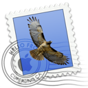 
  
  
  
  
  
  
  
  
  
  
  
  
  
  
  
  
  
  
  
  
  
  
  
  
  
  
  
  
  
  
  
  
  
  
  
  
  
  
  
 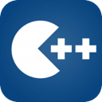 
  
  
  
  
  
  
  
  
  
  
  
  
  
  
  
 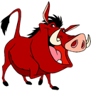 
  
  
  
  
  
 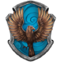 
  
  
  
  
  
  
  
  
  
  
  
  
  
  
  
 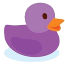 
  
  
  
  
  
  
  
  
 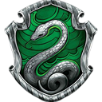 
  
  
  
  
  
  
  
  
  
  
  
  
  
  
  
  
  
  
  
 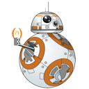 
  
  
  
  
  
 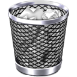 
  
  
  
  
  
  
  
  
  
  
  
  
  
  
  
  
  
  
  
  
  
  
  
  
  
  
  
  
  
  
  
  
  
  
  
  
  
  
  
  
  
  
  
  
  
  
  
  

Note that the party parrots (a.k.a. 'seizure-moji') are not displayed.
